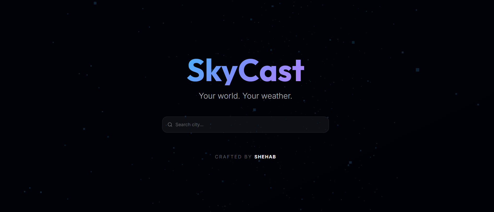
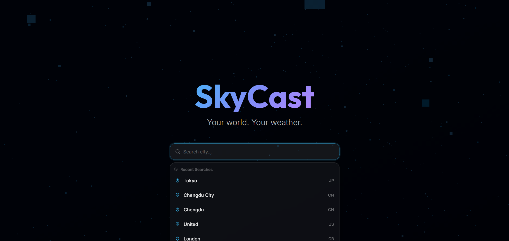
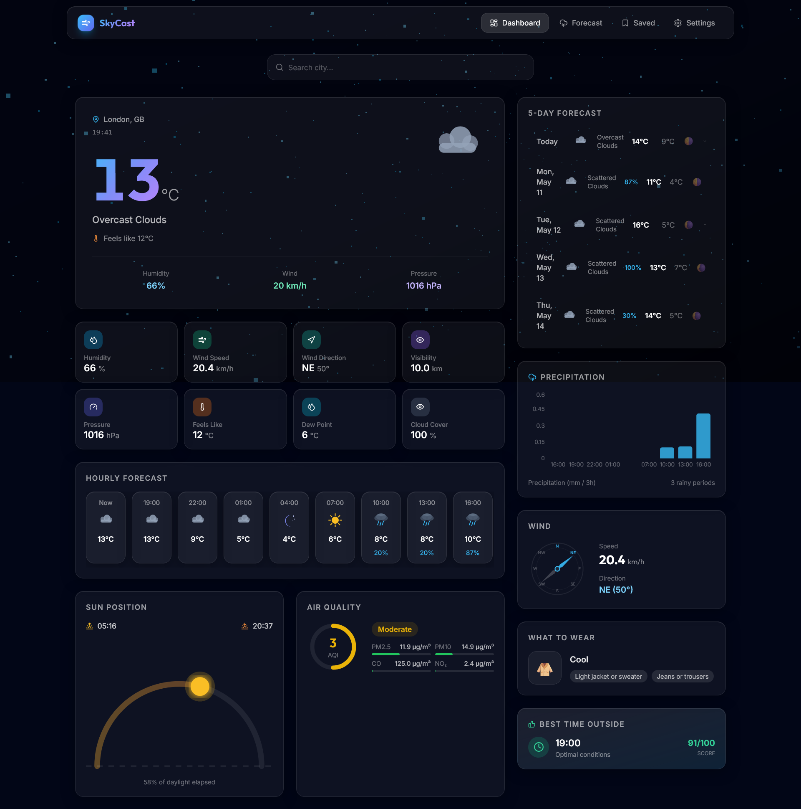
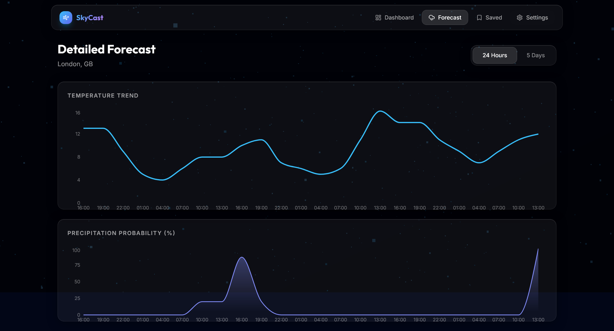
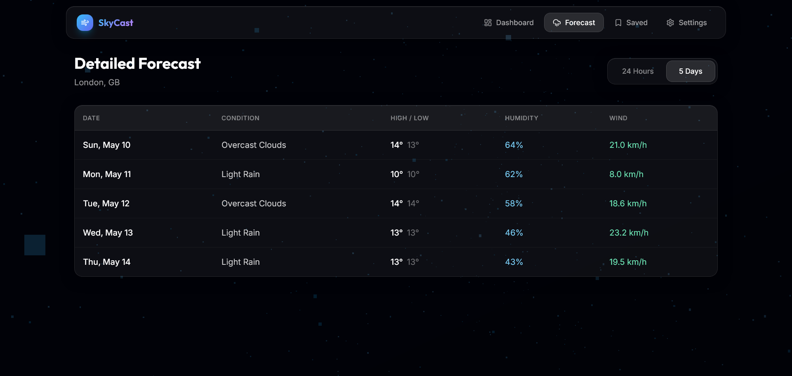
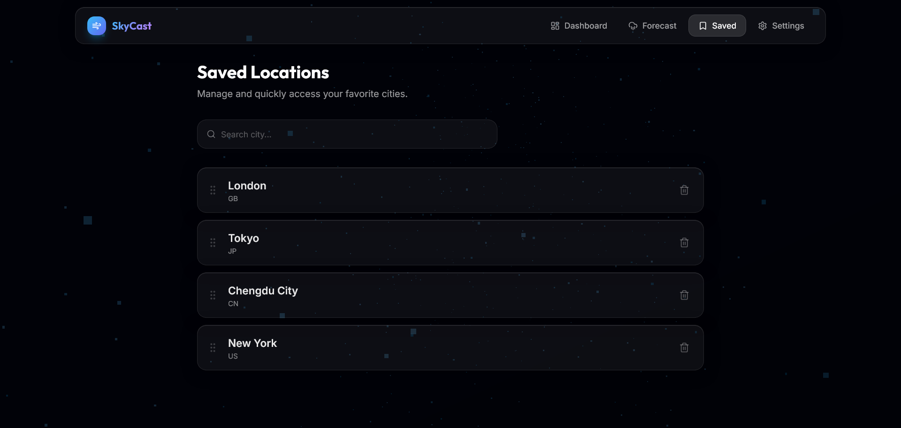
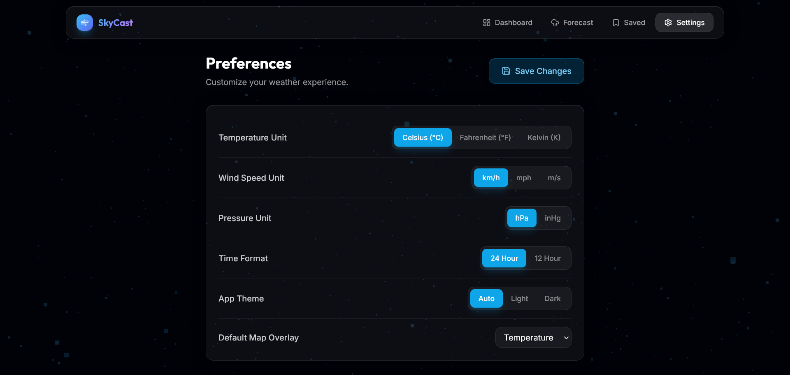

# SkyCast Weather Application

> **Live Demo:** [https://shehab-skycast.vercel.app](https://shehab-skycast.vercel.app)

Internship Task at CODTECH IT SOLUTIONS

### Internship Details

| | |
|:---|:---|
| **Company** | CODTECH IT SOLUTIONS |
| **Name** | SHEHAB MOHAMMAD SADIQUE |
| **Intern ID** | CTIS8896 |
| **Domain** | MERN STACK WEB DEVELOPMENT |
| **Duration** | 6 WEEKS |
| **Mentor** | NEELA SANTHOSH |
| **Task** | Task 2 — Weather Application |

---

## 📝 Project Description

This project is a modern, high-performance **SkyCast Weather Application** built as part of my MERN Stack Web Development internship at CODTECH IT SOLUTIONS. It demonstrates the implementation of fetching and displaying dynamic weather data using a public API.

At its core, the application utilizes **React.js** for building a dynamic, responsive, and visually stunning user interface, combined with **Node.js** and **Express.js** on the backend to securely proxy API requests. The live weather data is powered by the **OpenWeatherMap API**, ensuring accurate current conditions, 5-day forecasts, and air quality metrics. The application features a premium, modern design language, including a unique 3D-inspired glassmorphic interface and a sleek layout that provides a smooth user experience across devices.

**Key Features Include:**

- **Live Weather Tracking:** Real-time data fetching for current weather, hourly, and daily forecasts.
- **Modern UI/UX:** A premium, beautifully crafted interface with attention to aesthetics, smooth transitions, and responsive design using TailwindCSS.
- **3D Interactive Background:** An immersive, visually appealing 3D particle background using Three.js and Framer Motion that sets a high-end tone from the very beginning.
- **Clean Architecture:** Well-structured client-server MERN architecture separating frontend views from backend logic, with MongoDB persisting user preferences and saved locations.

This application serves as a comprehensive demonstration of full-stack development skills, focusing not just on core data fetching functionality but also on creating an engaging, premium user experience.

---

## 📸 Screenshots

### 1. Landing Page
An immersive 3D animated entry screen featuring a dynamic particle background, centered search bar, and elegant custom branding.

### 2. Smart Search Autocomplete
A highly responsive global search bar that fetches real-time city suggestions and displays recent search history seamlessly.

### 3. Main Dashboard
A comprehensive weather overview displaying real-time temperature, wind stats, air quality, precipitation charts, and sun position using a premium glassmorphic UI.

### 4. Detailed Forecast
An extended weather prediction view featuring two distinct modes: a 24-hour graphical trend and a 5-day daily breakdown.

**24 Hours View (Charts):**

**5 Days View (List):**

### 5. Saved Locations
A clean interface allowing users to easily view, manage, and quickly access their list of favorite saved cities.

### 6. Application Settings
A sleek preferences pane enabling users to seamlessly customize their global temperature and wind speed unit preferences.

---

## 🚀 Tech Stack

- **Frontend:** React.js, Vite, TailwindCSS (for premium styling), Framer Motion, Three.js
- **Backend:** Node.js, Express.js
- **Database:** MongoDB
- **APIs:** OpenWeatherMap API

---

   
  <h3>Crafted by SHEHAB</h3>
  
&copy; 2026 Shehab Sadique. All Rights Reserved.

